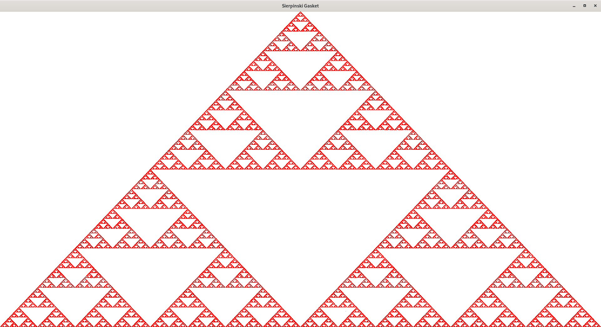
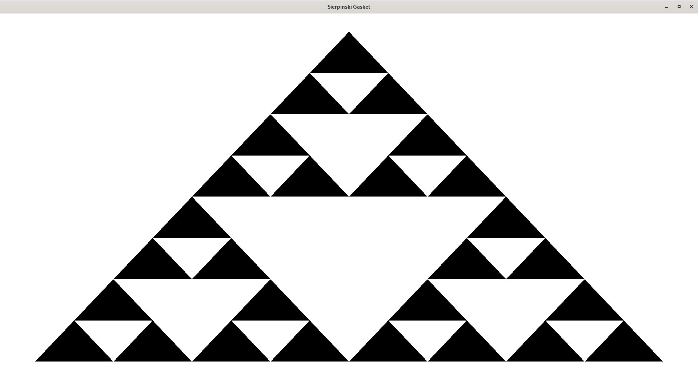
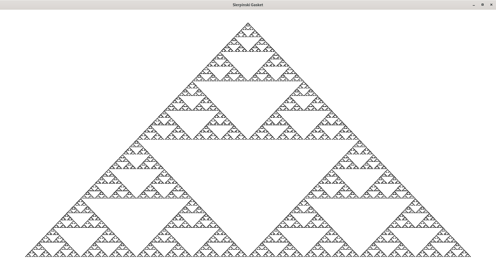
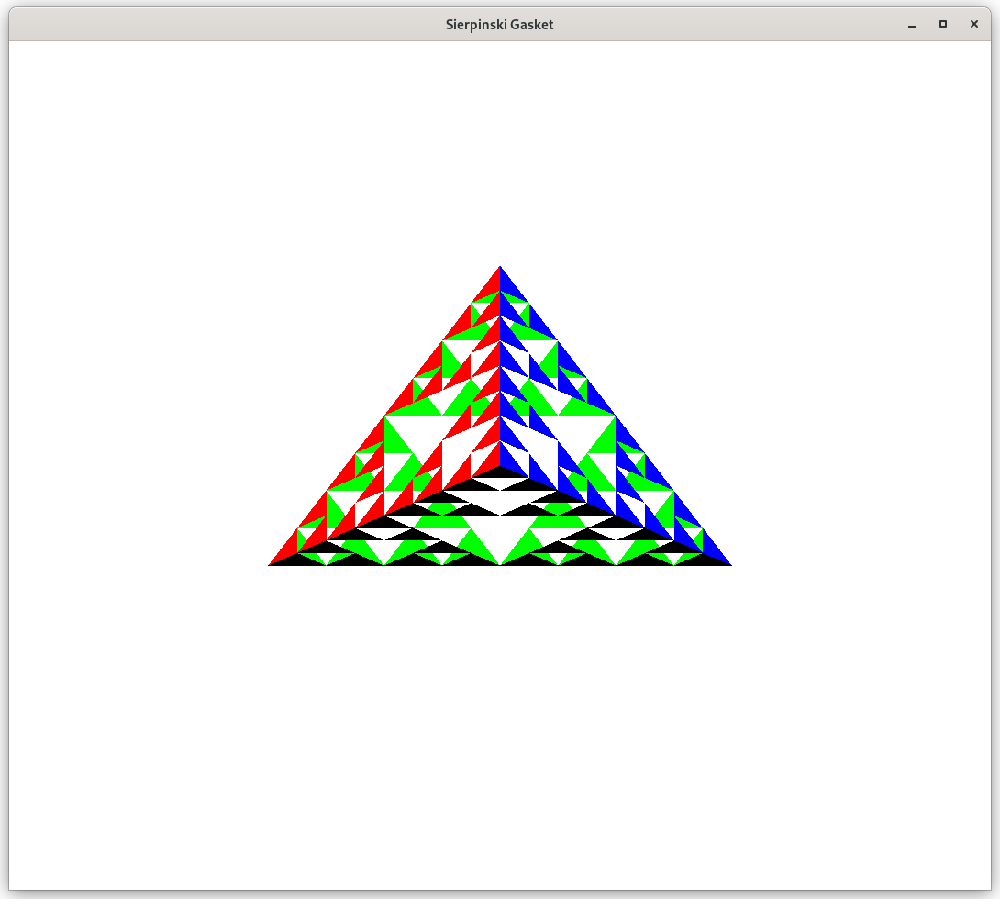
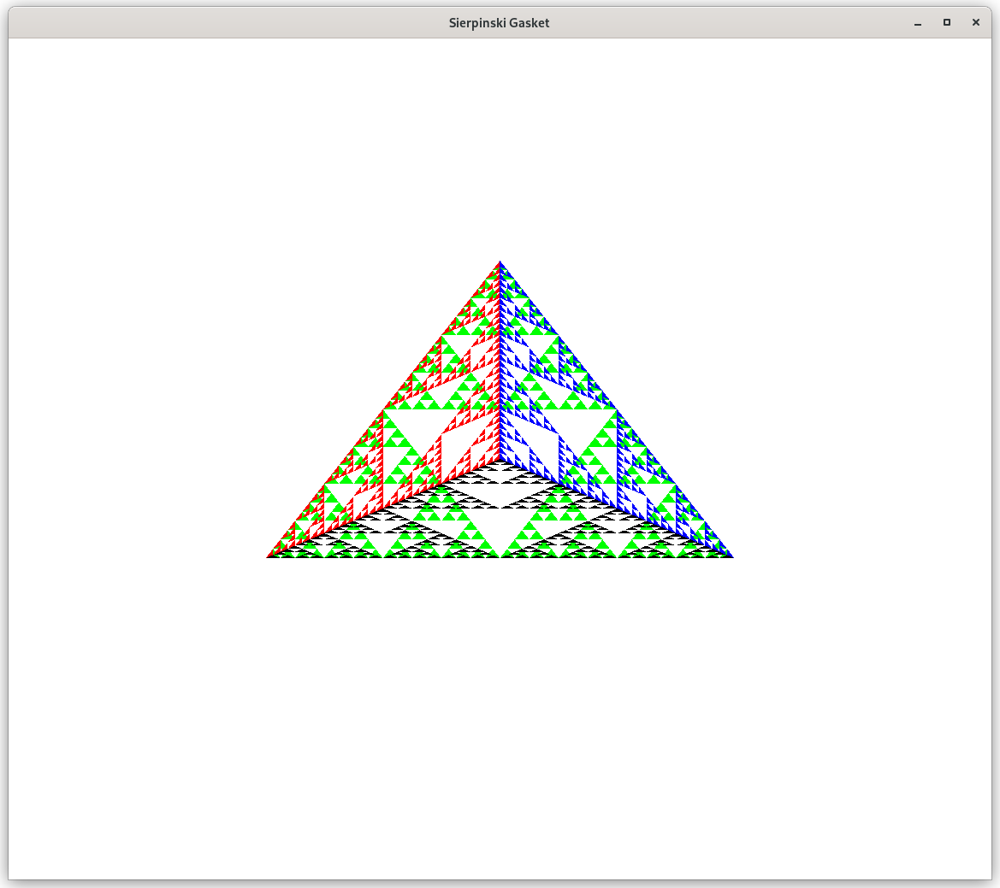
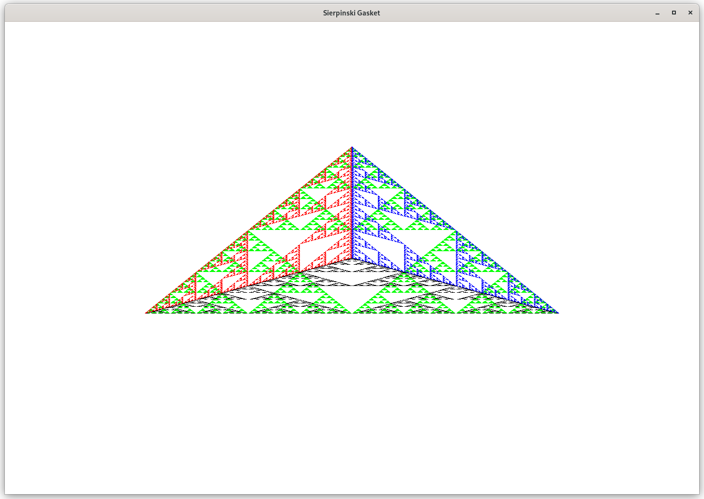

# Sierpinski_Gasket

Displaying the Serpinsky gasket using OpenGL. Fixed-function pipeline.

## Usage

### Iterative algorithm 2D
- `$>make sierpinski_gasket_2d_cycle` \
  `$>./sierpinski_gasket_2d_cycle 500000` \
  Number of points is 500000. \
  

### Recursive algorithm 2D
- `$>make sierpinski_gasket_2d_recursion` \
  `$>./sierpinski_gasket_2d_recursion 3` \
  Recursion depth is 3. \
   \
  `$>./sierpinski_gasket_2d_recursion 8` \
  Recursion depth is 8. \
  

### Recursive algorithm 3D
- `$>make sierpinski_gasket_3d` \
  `$>./sierpinski_gasket_3d 3` \
  Recursion depth is 3. \
   \
  `$>./sierpinski_gasket_3d 4` \
  Recursion depth is 4. \
   \
  `$>./sierpinski_gasket_3d 6` \
  Recursion depth is 6. \
  

